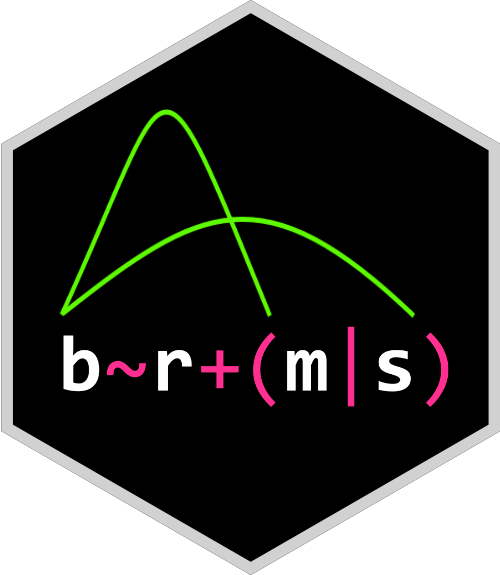

---
output:
  md_document:
    variant: markdown_github
---

<!-- README.md is generated from README.Rmd. Please edit that file -->

```{r, include=FALSE}
stopifnot(require(knitr))
options(width = 90)
knitr::opts_chunk$set(
  collapse = TRUE,
  comment = "#>",
  fig.path = "man/figures/README-",
  dev = "png",
  dpi = 150,
  fig.asp = 0.8,
  fig.width = 5,
  out.width = "60%",
  fig.align = "center"
)
library(brms)
ggplot2::theme_set(bayesplot::theme_default())
set.seed(1234)
```

[](https://mc-stan.org/)

# brms

[](https://github.com/paul-buerkner/brms/actions)
[](https://app.codecov.io/github/paul-buerkner/brms?branch=master)
[](https://cran.r-project.org/package=brms)
[](https://CRAN.R-project.org/package=brms)


## Overview

The **brms** package provides an interface to fit Bayesian generalized
(non-)linear multivariate multilevel models using Stan, which is a C++ package
for performing full Bayesian inference (see https://mc-stan.org/). The formula
syntax is very similar to that of the package lme4 to provide a familiar and
simple interface for performing regression analyses. A wide range of response
distributions are supported, allowing users to fit -- among others -- linear,
robust linear, count data, survival, response times, ordinal, zero-inflated, and
even self-defined mixture models all in a multilevel context. Further modeling
options include non-linear and smooth terms, auto-correlation structures,
censored data, missing value imputation, and quite a few more. In addition, all
parameters of the response distribution can be predicted in order to perform
distributional regression. Multivariate models (i.e., models with multiple
response variables) can be fit, as well. Prior specifications are flexible and
explicitly encourage users to apply prior distributions that actually reflect
their beliefs. Model fit can easily be assessed and compared with posterior
predictive checks, cross-validation, and Bayes factors.

## Resources

* [Introduction to brms](https://doi.org/10.18637/jss.v080.i01) (Journal of Statistical Software)
* [Advanced multilevel modeling with brms](https://journal.r-project.org/archive/2018/RJ-2018-017/index.html) (The R Journal)
* [Website](https://paul-buerkner.github.io/brms/) (Website of brms with documentation and vignettes)
* [Blog posts](https://paul-buerkner.github.io/software/brms-blogposts.html) (List of blog posts about brms)
* [Ask a question](https://discourse.mc-stan.org/) (Stan Forums on Discourse)
* [Open an issue](https://github.com/paul-buerkner/brms/issues) (GitHub issues for bug reports and feature requests)

##  How to use brms

```{r load, message=FALSE}
library(brms)
```

As a simple example, we use poisson regression to model the seizure counts in
epileptic patients to investigate whether the treatment (represented by variable
`Trt`) can reduce the seizure counts and whether the effect of the treatment
varies with the (standardized) baseline number of seizures a person had before
treatment (variable `zBase`). As we have multiple observations per person, a
group-level intercept is incorporated to account for the resulting dependency in
the data.

```{r fit1, results='hide', message=FALSE}
fit1 <- brm(count ~ zAge + zBase * Trt + (1|patient),
            data = epilepsy, family = poisson())
```

The results (i.e., posterior draws) can be investigated using

```{r summary}
summary(fit1)
```

On the top of the output, some general information on the model is given, such
as family, formula, number of iterations and chains. Next, group-level effects
are displayed separately for each grouping factor in terms of standard
deviations and (in case of more than one group-level effect per grouping factor;
not displayed here) correlations between group-level effects. On the bottom of
the output, population-level effects (i.e. regression coefficients) are
displayed. If incorporated, autocorrelation effects and family specific
parameters (e.g., the residual standard deviation 'sigma' in normal models) are
also given.

In general, every parameter is summarized using the mean ('Estimate') and the
standard deviation ('Est.Error') of the posterior distribution as well as
two-sided 95% credible intervals ('l-95% CI' and 'u-95% CI') based on quantiles.
We see that the coefficient of `Trt` is negative with a zero overlapping
95\%-CI. This indicates that, on average, the treatment may reduce seizure
counts by some amount but the evidence based on the data and applied model is
not very strong and still insufficient by standard decision rules. Further, we
find little evidence that the treatment effect varies with the baseline number
of seizures.

The last three values ('ESS_bulk', 'ESS_tail', and 'Rhat') provide information
on how well the algorithm could estimate the posterior distribution of this
parameter. If 'Rhat' is considerably greater than 1, the algorithm has not yet
converged and it is necessary to run more iterations and / or set stronger
priors.

To visually investigate the chains as well as the posterior distributions, we
can use the `plot` method. If we just want to see results of the regression
coefficients of `Trt` and `zBase`, we go for

```{r plot}
plot(fit1, variable = c("b_Trt1", "b_zBase"))
```

A more detailed investigation can be performed by running
`launch_shinystan(fit1)`. To better understand the relationship of the
predictors with the response, I recommend the `conditional_effects` method:

```{r conditional_effects}
plot(conditional_effects(fit1, effects = "zBase:Trt"))
```

This method uses some prediction functionality behind the scenes, which can also
be called directly. Suppose that we want to predict responses (i.e. seizure
counts) of a person in the treatment group (`Trt = 1`) and in the control group
(`Trt = 0`) with average age and average number of previous seizures. Than we
can use

```{r predict}
newdata <- data.frame(Trt = c(0, 1), zAge = 0, zBase = 0)
predict(fit1, newdata = newdata, re_formula = NA)
```

We need to set `re_formula = NA` in order not to condition of the group-level
effects. While the `predict` method returns predictions of the responses, the
`fitted` method returns predictions of the regression line.

```{r fitted}
fitted(fit1, newdata = newdata, re_formula = NA)
```

Both methods return the same estimate (up to random error), while the latter has
smaller variance, because the uncertainty in the regression line is smaller than
the uncertainty in each response. If we want to predict values of the original
data, we can just leave the `newdata` argument empty.

Suppose, we want to investigate whether there is overdispersion in the model,
that is residual variation not accounted for by the response distribution. For
this purpose, we include a second group-level intercept that captures possible
overdispersion.

```{r fit2, results='hide', message=FALSE}
fit2 <- brm(count ~ zAge + zBase * Trt + (1|patient) + (1|obs),
            data = epilepsy, family = poisson())
```

We can then go ahead and compare both models via approximate leave-one-out (LOO)
cross-validation.

```{r loo, warning=FALSE}
loo(fit1, fit2)
```

The `loo` output when comparing models is a little verbose. We first see the
individual LOO summaries of the two models and then the comparison between them.
Since higher `elpd` (i.e., expected log posterior density) values indicate
better fit, we see that the model accounting for overdispersion (i.e., `fit2`)
fits substantially better. However, we also see in the individual LOO outputs
that there are several problematic observations for which the approximations may
have not have been very accurate. To deal with this appropriately, we need to fall
back to other methods such as `reloo` or `kfold` but this requires the model to
be refit several times which takes too long for the purpose of a quick example.
The post-processing methods we have shown above are just the tip of the
iceberg. For a full list of methods to apply on fitted model objects, type
`methods(class = "brmsfit")`.

## Citing brms and related software

Developing and maintaining open source software is an important yet often
underappreciated contribution to scientific progress. Thus, whenever you are
using open source software (or software in general), please make sure to cite it
appropriately so that developers get credit for their work.

When using brms, please cite one or more of the following publications:

- Bürkner P. C. (2017). brms: An R Package for Bayesian Multilevel Models
  using Stan. *Journal of Statistical Software*. 80(1), 1-28.
  doi.org/10.18637/jss.v080.i01
- Bürkner P. C. (2018). Advanced Bayesian Multilevel Modeling with the R
  Package brms. *The R Journal*. 10(1), 395-411. doi.org/10.32614/RJ-2018-017
- Bürkner P. C. (2021). Bayesian Item Response Modeling in R with brms and Stan. 
  *Journal of Statistical Software*, 100(5), 1-54. doi.org/10.18637/jss.v100.i05

As brms is a high-level interface to Stan, please additionally cite Stan
(see also https://mc-stan.org/users/citations/):

- Stan Development Team. YEAR. Stan Modeling Language Users Guide and Reference 
  Manual, VERSION. https://mc-stan.org
- Carpenter B., Gelman A., Hoffman M. D., Lee D., Goodrich B., Betancourt M.,
  Brubaker M., Guo J., Li P., and Riddell A. (2017). Stan: A probabilistic
  programming language. *Journal of Statistical Software*. 76(1).
  doi.org/10.18637/jss.v076.i01

Further, brms relies on several other R packages and, of course, on R itself. To
find out how to cite R and its packages, use the `citation` function. There are
some features of brms which specifically rely on certain packages. The **rstan**
package together with **Rcpp** makes Stan conveniently accessible in R.
Visualizations and posterior-predictive checks are based on **bayesplot** and
**ggplot2**. Approximate leave-one-out cross-validation using `loo` and related
methods is done via the **loo** package. Marginal likelihood based methods such
as `bayes_factor` are realized by means of the **bridgesampling** package.
Splines specified via the `s` and `t2` functions rely on **mgcv**. If you use
some of these features, please also consider citing the related packages.

## FAQ

### How do I install brms?

To install the latest release version from CRAN use

```{r install_brms, eval=FALSE}
install.packages("brms")
```

The current developmental version can be downloaded from GitHub via

```{r install_brms2, eval=FALSE}
if (!requireNamespace("remotes")) {
  install.packages("remotes")
}
remotes::install_github("paul-buerkner/brms")
```

Because brms is based on Stan, a C++ compiler is required. The program Rtools
(available on https://cran.r-project.org/bin/windows/Rtools/) comes with a C++
compiler for Windows. On Mac, you should install Xcode. For further instructions
on how to get the compilers running, see the prerequisites section on
https://github.com/stan-dev/rstan/wiki/RStan-Getting-Started.

### I am new to brms. Where can I start?

Detailed instructions and case studies are given in the package's extensive
vignettes. See `vignette(package = "brms")` for an overview. For documentation
on formula syntax, families, and prior distributions see `help("brm")`.

### Where do I ask questions, propose a new feature, or report a bug?

Questions can be asked on the [Stan forums](https://discourse.mc-stan.org/) on
Discourse. To propose a new feature or report a bug, please open an issue on
[GitHub](https://github.com/paul-buerkner/brms).

### How can I extract the generated Stan code?

If you have already fitted a model, just apply the `stancode` method on the
fitted model object. If you just want to generate the Stan code without any
model fitting, use the `make_stancode` function.

### Can I avoid compiling models?

When you fit your model for the first time with brms, there is currently no way
to avoid compilation. However, if you have already fitted your model and want to
run it again, for instance with more draws, you can do this without
recompilation by using the `update` method. For more details see
`help("update.brmsfit")`.

### What is the difference between brms and rstanarm?

The rstanarm package is similar to brms in that it also allows to fit regression
models using Stan for the backend estimation. Contrary to brms, rstanarm comes
with precompiled code to save the compilation time (and the need for a C++
compiler) when fitting a model. However, as brms generates its Stan code on the
fly, it offers much more flexibility in model specification than rstanarm. Also,
multilevel models are currently fitted a bit more efficiently in brms. For
detailed comparisons of brms with other common R packages implementing
multilevel models, see `vignette("brms_multilevel")` and
`vignette("brms_overview")`.
