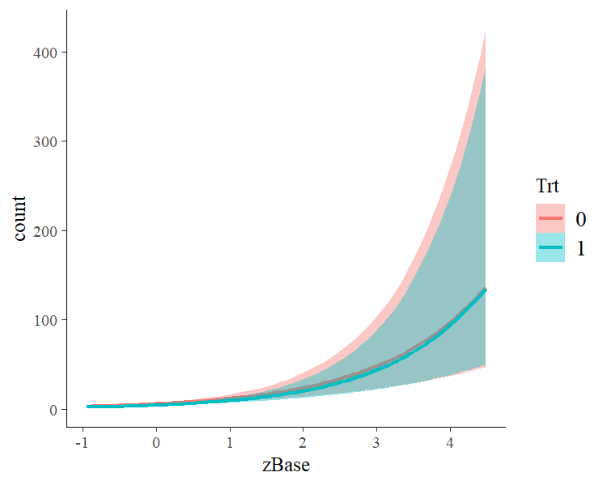

<!-- README.md is generated from README.Rmd. Please edit that file -->

[](http://mc-stan.org)

brms
====

[](https://travis-ci.org/paul-buerkner/brms)
[](https://cran.r-project.org/package=brms)
[](https://codecov.io/github/paul-buerkner/brms?branch=master)

Overview
--------

The **brms** package provides an interface to fit Bayesian generalized
(non-)linear multivariate multilevel models using Stan, which is a C++
package for performing full Bayesian inference (see
<a href="http://mc-stan.org/" class="uri">http://mc-stan.org/</a>). The
formula syntax is very similar to that of the package lme4 to provide a
familiar and simple interface for performing regression analyses. A wide
range of response distributions are supported, allowing users to fit –
among others – linear, robust linear, count data, survival, response
times, ordinal, zero-inflated, and even self-defined mixture models all
in a multilevel context. Further modeling options include non-linear and
smooth terms, auto-correlation structures, censored data, missing value
imputation, and quite a few more. In addition, all parameters of the
response distribution can be predicted in order to perform
distributional regression. Multivariate models (i.e., models with
multiple response variables) can be fit, as well. Prior specifications
are flexible and explicitly encourage users to apply prior distributions
that actually reflect their beliefs. Model fit can easily be assessed
and compared with posterior predictive checks, cross-validation, and
Bayes factors.

Resources
---------

-   [Introduction to
    brms](https://www.jstatsoft.org/article/view/v080i01) (Journal of
    Statistical Software)
-   [Advanced multilevel modeling with
    brms](https://journal.r-project.org/archive/2018/RJ-2018-017/index.html)
    (The R Journal)
-   [Website](https://paul-buerkner.github.io/brms) (Website of brms
    with documentation and vignettes)
-   [Blog posts](https://paul-buerkner.github.io/blog/brms-blogposts/)
    (List of blog posts about brms)
-   [Ask a question](http://discourse.mc-stan.org/) (Stan Forums on
    Discourse)
-   [Open an issue](https://github.com/paul-buerkner/brms/issues)
    (GitHub issues for bug reports and feature requests)

How to use brms
---------------

``` r
library(brms)
```

As a simple example, we use poisson regression to model the seizure
counts in epileptic patients to investigate whether the treatment
(represented by variable `Trt`) can reduce the seizure counts and
whether the effect of the treatment varies with the (standardized)
baseline number of seizures a person had before treatment (variable
`zBase`). As we have multiple observations per person, a group-level
intercept is incorporated to account for the resulting dependency in the
data.

``` r
fit1 <- brm(count ~ zAge + zBase * Trt + (1|patient), 
            data = epilepsy, family = poisson())
```

The results (i.e., posterior samples) can be investigated using

``` r
summary(fit1) 
#>  Family: poisson 
#>   Links: mu = log 
#> Formula: count ~ zAge + zBase * Trt + (1 | patient) 
#>    Data: epilepsy (Number of observations: 236) 
#> Samples: 4 chains, each with iter = 2000; warmup = 1000; thin = 1;
#>          total post-warmup samples = 4000
#> 
#> Group-Level Effects: 
#> ~patient (Number of levels: 59) 
#>               Estimate Est.Error l-95% CI u-95% CI Eff.Sample Rhat
#> sd(Intercept)     0.59      0.07     0.47     0.74        786 1.00
#> 
#> Population-Level Effects: 
#>            Estimate Est.Error l-95% CI u-95% CI Eff.Sample Rhat
#> Intercept      1.78      0.12     1.53     2.02        691 1.01
#> zAge           0.09      0.09    -0.08     0.27        758 1.00
#> zBase          0.70      0.12     0.47     0.96        496 1.01
#> Trt1          -0.27      0.17    -0.62     0.06        650 1.01
#> zBase:Trt1     0.06      0.17    -0.27     0.38        557 1.01
#> 
#> Samples were drawn using sampling(NUTS). For each parameter, Eff.Sample 
#> is a crude measure of effective sample size, and Rhat is the potential 
#> scale reduction factor on split chains (at convergence, Rhat = 1).
```

On the top of the output, some general information on the model is
given, such as family, formula, number of iterations and chains. Next,
group-level effects are displayed seperately for each grouping factor in
terms of standard deviations and (in case of more than one group-level
effect per grouping factor; not displayed here) correlations between
group-level effects. On the bottom of the output, population-level
effects (i.e. regression coefficients) are displayed. If incorporated,
autocorrelation effects and family specific parameters (e.g. the
residual standard deviation ‘sigma’ in normal models) are also given.

In general, every parameter is summarized using the mean (‘Estimate’)
and the standard deviation (‘Est.Error’) of the posterior distribution
as well as two-sided 95% credible intervals (‘l-95% CI’ and ‘u-95% CI’)
based on quantiles. We see that the coefficient of `Trt` is negative
with a completely negative 95%-CI indicating that, on average, the
treatment reduces seizure counts by some amount. Further, we find little
evidence that the treatment effect varies with the baseline number of
seizures.

The last two values (‘Eff.Sample’ and ‘Rhat’) provide information on how
well the algorithm could estimate the posterior distribution of this
parameter. If ‘Rhat’ is considerably greater than 1, the algorithm has
not yet converged and it is necessary to run more iterations and / or
set stronger priors.

To visually investigate the chains as well as the posterior
distributions, we can use the `plot` method. If we just want to see
results of the regression coefficients of `Trt` and `zBase`, we go for

``` r
plot(fit1, pars = c("Trt", "zBase")) 
```


A more detailed investigation can be performed by running
`launch_shinystan(fit1)`. To better understand the relationship of the
predictors with the response, I recommend the `marginal_effects` method:

``` r
plot(marginal_effects(fit1, effects = "zBase:Trt"))
```



This method uses some prediction functionality behind the scenes, which
can also be called directly. Suppose that we want to predict responses
(i.e. seizure counts) of a person in the treatment group (`Trt = 1`) and
in the control group (`Trt = 0`) with average age and average number of
previous seizures. Than we can use

``` r
newdata <- data.frame(Trt = c(0, 1), zAge = 0, zBase = 0)
predict(fit1, newdata = newdata, re_formula = NA)
#>      Estimate Est.Error Q2.5 Q97.5
#> [1,]    5.973  2.567181    2    12
#> [2,]    4.548  2.129984    1     9
```

We need to set `re_formula = NA` in order not to condition of the
group-level effects. While the `predict` method returns predictions of
the responses, the `fitted` method returns predictions of the regression
line.

``` r
fitted(fit1, newdata = newdata, re_formula = NA)
#>      Estimate Est.Error     Q2.5    Q97.5
#> [1,] 5.946417 0.7422929 4.637616 7.540027
#> [2,] 4.535893 0.5274356 3.588178 5.640799
```

Both methods return the same estimate (up to random error), while the
latter has smaller variance, because the uncertainty in the regression
line is smaller than the uncertainty in each response. If we want to
predict values of the original data, we can just leave the `newdata`
argument empty.

Suppose, we want to investigate whether there is overdispersion in the
model, that is residual variation not accounted for by the response
distribution. For this purpose, we include a second group-level
intercept that captures possible overdispersion.

``` r
fit2 <- brm(count ~ zAge + zBase * Trt + (1|patient) + (1|obs), 
            data = epilepsy, family = poisson())
```

We can then go ahead and compare both models via approximate
leave-one-out cross-validation.

``` r
loo(fit1, fit2)
#>               LOOIC    SE
#> fit1        1344.40 75.20
#> fit2        1183.91 27.21
#> fit1 - fit2  160.48 57.69
```

Since higher `LOOIC` values indicate better fit, we see that the model
accounting for overdispersion fits substantially better. The
post-processing methods we have shown so far are just the tip of the
iceberg. For a full list of methods to apply on fitted model objects,
type `methods(class = "brmsfit")`.

FAQ
---

### How do I install brms?

To install the latest release version from CRAN use

``` r
install.packages("brms")
```

The current developmental version can be downloaded from github via

``` r
if (!requireNamespace("devtools")) {
  install.packages("devtools")
}
devtools::install_github("paul-buerkner/brms")
```

Because brms is based on Stan, a C++ compiler is required. The program
Rtools (available on
<a href="https://cran.r-project.org/bin/windows/Rtools/" class="uri">https://cran.r-project.org/bin/windows/Rtools/</a>)
comes with a C++ compiler for Windows. On Mac, you should install Xcode.
For further instructions on how to get the compilers running, see the
prerequisites section on
<a href="https://github.com/stan-dev/rstan/wiki/RStan-Getting-Started" class="uri">https://github.com/stan-dev/rstan/wiki/RStan-Getting-Started</a>.

### I am new to brms. Where can I start?

Detailed instructions and case studies are given in the package’s
extensive vignettes. See `vignette(package = "brms")` for an overview.
For documentation on formula syntax, families, and prior distributions
see `help("brm")`.

### How do I cite brms?

Please cite one or more of the following publications:

-   Bürkner P. C. (2017). brms: An R Package for Bayesian Multilevel
    Models using Stan. *Journal of Statistical Software*. 80(1), 1-28.
    <a href="doi:10.18637/jss.v080.i01" class="uri">doi:10.18637/jss.v080.i01</a>
-   Bürkner P. C. (in press). Advanced Bayesian Multilevel Modeling with
    the R Package brms. *The R Journal*.

### Where do I ask questions, propose a new feature, or report a bug?

Questions can be asked on the [Stan
forums](http://discourse.mc-stan.org/) on Discourse. To propose a new
feature or report a bug, please open an issue on
[GitHub](https://github.com/paul-buerkner/brms).

### How can I extract the generated Stan code?

If you have already fitted a model, just apply the `stancode` method on
the fitted model object. If you just want to generate the Stan code
without any model fitting, use the `make_stancode` function.

### Can I avoid compiling models?

When you fit your model for the first time with brms, there is currently
no way to avoid compilation. However, if you have already fitted your
model and want to run it again, for instance with more samples, you can
do this without recompilation by using the `update` method. For more
details see `help("update.brmsfit")`.

### What is the difference between brms and rstanarm?

The rstanarm package is similar to brms in that it also allows to fit
regression models using Stan for the backend estimation. Contrary to
brms, rstanarm comes with precompiled code to save the compilation time
(and the need for a C++ compiler) when fitting a model. However, as brms
generates its Stan code on the fly, it offers much more flexibility in
model specification than rstanarm. Also, multilevel models are currently
fitted a bit more efficiently in brms. For detailed comparisons of brms
with other common R packages implementing multilevel models, see
`vignette("brms_multilevel")` and `vignette("brms_overview")`.
